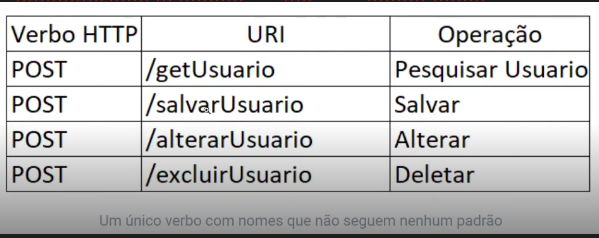
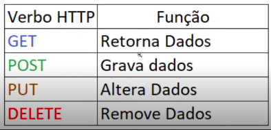
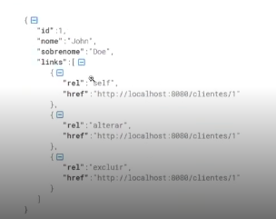

# Spring Web Rest API

## REST e RESTful

A API REST (representational state transfer) é como um guia de  boas práticas e RESTful é a capacidade de determinado sistema aplicar os princípios REST.

Para que uma arquitetura seja RESTful, é necessário ter uma séria de padrões;
- Cliente-Servidor;
- Interface Uniforme;
- Stateless - indica que cada interação via API tem acesso a dados completos e compreensíveis.
- Cache - necessário para reudizr o tempo médio de resposta.
- Camadas - permite que a arquitetura seja menos complexa e altamente flexível.

## Nível de maturidade da API REST
### 0 - Ausencia de regras
Implementa todos os recursos mas não segue nenhum padrão.

### 1 - Aplicação de Resourses

### 2 - Implementação de verbos HTTP
O nível 2 se encarrega de validar a aplicabilidade dos verbos para finaliaddes específicas como:


3 - HATEOAS
Significa *Hypermedia as the Engine of Application State*. Fornecer links que indicarão como poderá ser feita a nevegação entre seus recursos na resposta da requisição. É um nível muito menos explorado no mercado.


# Iniciando uma API no Spring Boot
Para começar uma api, precisa adicionar o starter spring-boot-starter-web.
Essa dependência adicionará o host Tomcat que iniciará o host na porta 8080.

### Criando o Controller
O controller é o recurso que disponibilizará as funcionalidades de negócio da aplicação através do protocolo HTTP.
Todo controller no SpringBoot recebe a anotação @RestController

```
@RestController  
public class WelcomeController {  
    @GetMapping("/welcome")  
    public String welcome() {  
        return "Welcome to Spring Boot REST API";  
    }  
}
```

### Rest Controller
Anotações e configurações mais comuns:
- @RestController
- @RequestMapping("prefix"): determina a URI comum para o controller
- @GetMapping
- @PostMapping
- @PutMapping
- @DeleteMapping
- @RequestBody: Converte um JSON para o tipo de objeto esperado como parâmetro no método
- @PathVariable: Consegue determinar que parte da URI será compostas por parâmetros recebidos nas requisições

Exemplo:
(Obs: foi chamado o repository direto pelo controller somente para fins de teste)
```
@RestController  
@RequestMapping("/user")  
public class UsuarioController {  
  
    @Autowired  
    private UsuarioService service;  
  
  
    @GetMapping  
    public List<Usuario> getUsers() {  
        return service.getUsers();  
    }  
  
    @GetMapping("/{id}")  
    public Usuario getUser(@PathVariable Integer id) {  
        return service.getUser(id);  
    }  
  
    @PostMapping  
    public Usuario createUsuario(@RequestBody Usuario usuario) {  
        return service.createUsuario(usuario);  
    }  
  
    @DeleteMapping("/{id}")  
    @ResponseStatus(HttpStatus.OK)  
    public void deleteUsuario(@PathVariable("id") Integer id) {  
        service.deleteUsuario(id);  
    }  
  
    @PutMapping("/{id}")  
    public Usuario updateUsuario(@RequestBody Usuario usuario, @PathVariable("id") Integer id) {  
        return service.updateUsuario(usuario, id);  
    }  
}
```
[Request Mapping Doc](https://docs.spring.io/spring-framework/reference/web/webmvc/mvc-controller/ann-requestmapping.html)


## Documentando API
Com Swagger para Spring Boot versões < 3.x
Adicionar a dependencia no POM;
```
<dependency>  
    <groupId>io.springfox</groupId>  
    <artifactId>springfox-swagger2</artifactId>  
    <version>2.9.2</version>  
</dependency>  
<dependency>  
    <groupId>io.springfox</groupId>  
    <artifactId>springfox-swagger-ui</artifactId>  
    <version>2.9.2</version>  
</dependency>
```

Criar uma classe chamada SwaggerConfig e adicionar os métodos abaixo:
```
@Configuration  
@EnableSwagger2  
public class SwaggerConfig {  
  
    private Contact contato() {  
        return new Contact(  
        "Gustavo Kraemer",  
        "https://github.com/gustavokra",  
        "gustavo.kraemer6@gmail.com");  
    }  
  
    private ApiInfoBuilder informacoesApi() {  
        ApiInfoBuilder apiInfoBuilder = new ApiInfoBuilder();  
  
        apiInfoBuilder.title("Primeira API Com Spring Boot - Rest API");  
        apiInfoBuilder.description("API de exemplo para uso do Spring Boot, com spring-boot-starter-web e spring-boot-starter-jpa");  
        apiInfoBuilder.version("1.0");  
        apiInfoBuilder.termsOfServiceUrl("Termos de uso: Open Source");  
        apiInfoBuilder.license("Licença - Gustavo Kraemer");  
        apiInfoBuilder.licenseUrl("https://github.com/gustavokra");  
        apiInfoBuilder.contact(this.contato());  
  
        return apiInfoBuilder;  
    }  
  
    @Bean  
    public Docket detalheApi() {  
        Docket docket = new Docket(DocumentationType.SWAGGER_2);  
  
        return docket  
                .select()  
                .apis(RequestHandlerSelectors.basePackage("com.kraemer.primeira_api_spring.controller"))  
                .paths(PathSelectors.any())  
                .build()  
                .apiInfo(this.informacoesApi().build())  
                .consumes(new HashSet<String>(List.of("application/json")))  
                .produces(new HashSet<String>(List.of("application/json")));  
    }  
}
```

## Para Sping Boot > 3.x
Adicionar o starter web mvc:
```
<dependency>  
    <groupId>org.springdoc</groupId>  
    <artifactId>springdoc-openapi-starter-webmvc-ui</artifactId>  
    <version>2.6.0</version>  
</dependency>
```

Depois acessar
> http://localhost:8080/swagger-ui/index.html

## Exception Handler

É um manipulador de exceção, ou seja, é o código que estipula o que um programa fará quando um evento interromper o fluxo normal de instruções.

Existem dois tipos de tratamento de exceções em uma aplicaçõ Spring Web,. A mais comum é a ControllerAdvice.

Solução 1: Nível do Controller - @ExceptionHandler
Cada método trata uma exceção de forma declarativa com @ExceptionHandler.

```
public class MeuController {
	@ExceptionHandler({MinhaException.class})
	public void meuMetodo() {
	
	}
}
```

Solução 2: ResponseStatusExceptionResolver
Usa a anotação @ResponseStatus disponível em exceções personalizadas e mapear essas exceções para códigos de status HTTP.

```
@ResponseStatus(value = HttpStatus.NOT_FOUND)
public class RecursoNotFoundException extends RuntimeException {
	public RecursoNotFoundException() {
		super();
	}
	public RecursoNotFoundException(String message) {
		super(message);
	}
}
```

## RestControllerAdvice

Spring 3.2 traz suporte para um @ExceptionHandler global com a anotação @ControllerAdvice, que permite consolidar múltiplos @ExceptionHandlers espalhados de antes em um único componente global de tratamento de erros.

## Configurando GlobalExceptionHandler
Customizando nossas mensagens.
Uma resposta HTTP mesmo sendo um erro pode ser considerada um Objeto que será convertido em JSON expondo informações relacionadas a exceção disparada.
```
public class ResponseError {
	private Date timestamp = new Date();
	private String status = "error";
	private int statusCode = 400;
	private String error;
	
	//getters e setters
}
```

Criamos uma exceção extendendo e RunTimeException
``` 
public class BusinessException extends RuntimeException {  
  
    public BusinessException(String mensagem) {  
        super(mensagem);  
    }  
  
    public BusinessException(String mensagem, Object ... params) {  
        super(String.format(mensagem, params));  
    }  
  
}
```

E então criamos o detector global de exceções:
```
package com.kraemer.primeira_api_spring.handler;  
  
import jakarta.annotation.Resource;  
import org.springframework.cglib.proxy.UndeclaredThrowableException;  
import org.springframework.context.MessageSource;  
import org.springframework.http.HttpHeaders;  
import org.springframework.http.HttpStatus;  
import org.springframework.http.MediaType;  
import org.springframework.http.ResponseEntity;  
import org.springframework.web.bind.annotation.ExceptionHandler;  
import org.springframework.web.bind.annotation.RestControllerAdvice;  
import org.springframework.web.context.request.WebRequest;  
import org.springframework.web.servlet.mvc.method.annotation.ResponseEntityExceptionHandler;  
  
@RestControllerAdvice  
public class GlobalExceptionHandler extends ResponseEntityExceptionHandler {  
  
    @Resource  
    private MessageSource messageSource;  
    private HttpHeaders headers() {  
        HttpHeaders headers = new HttpHeaders();  
        headers.setContentType(MediaType.APPLICATION_JSON);  
        return headers;  
    }  
  
    private ResponseError responseError(String message,HttpStatus statusCode) {  
        ResponseError responseError = new ResponseError();  
        responseError.setStatus("error");  
        responseError.setError(message);  
        responseError.setStatusCode(statusCode.value());  
        return responseError;  
    }  
  
    @ExceptionHandler(Exception.class)  
    private ResponseEntity<Object> handleGeneral(Exception e, WebRequest request) {  
        if (e.getClass().isAssignableFrom(UndeclaredThrowableException.class)) {  
            UndeclaredThrowableException exception = (UndeclaredThrowableException) e;  
            return handleBusinessException((BusinessException) exception.getUndeclaredThrowable(), request);  
        } else {  
            String message = messageSource.getMessage("error.server", new Object[]{e.getMessage()}, null);  
            ResponseError error = responseError(message, HttpStatus.INTERNAL_SERVER_ERROR);  
            return handleExceptionInternal(e, error, headers(), HttpStatus.INTERNAL_SERVER_ERROR, request);  
        }  
    }  
  
    @ExceptionHandler({BusinessException.class})  
    private ResponseEntity<Object> handleBusinessException(BusinessException e, WebRequest request) {  
        ResponseError error = responseError(e.getMessage(),HttpStatus.CONFLICT);  
        return handleExceptionInternal(e, error, headers(), HttpStatus.CONFLICT, request);  
    }  
  
}
```

Explicação:
```private MessageSource messageSource;```  -> Objeto pega mensagens da origem das exceções executada nas requisições HTTP.

```private HttpHeaders headers()``` -> Cabeçário do retorno da requisição.

```private ResponseError responseError(String message,HttpStatus statusCode)```
-> compõe o esqueleto do erro que será mostrado.

```
@ExceptionHandler(Exception.class)  
private ResponseEntity<Object> handleGeneral(Exception e, WebRequest request)
```
Ao captar qualquer tipo de excessão por meio de request,  verifica se é do tipo BusinessException.
Se for, chama o
```
@ExceptionHandler({BusinessException.class})  
private ResponseEntity<Object> handleBusinessException(BusinessException e, WebRequest request)
```
Que monta o response error e lança a excessao com o HttpStatus Conflict.

